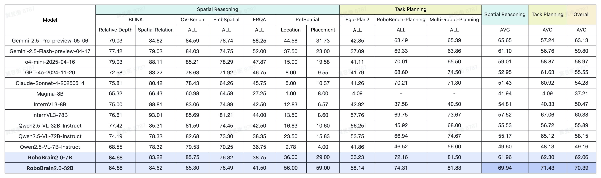

<div align="center">

</div>

# RoboBrain 2.0: See Better. Think Harder. Do Smarter. 


<p align="center">
        </a>&nbsp&nbsp⭐️ <a href="https://superrobobrain.github.io/">Project</a></a>&nbsp&nbsp | &nbsp&nbsp🤗 <a href="https://huggingface.co/collections/BAAI/robobrain20-6841eeb1df55c207a4ea0036/">Hugging Face</a>&nbsp&nbsp | &nbsp&nbsp🤖 <a href="https://www.modelscope.cn/models/BAAI/RoboBrain2.0-7B/files/">ModelScope</a>&nbsp&nbsp | &nbsp&nbsp📑 <a href="">Technical Report (Coming soon)</a>&nbsp&nbsp | &nbsp&nbsp💬 <a href="./assets/wechat.png">WeChat</a>
</p>
<p align="center">
        </a>&nbsp&nbsp🎯 <a href="https://github.com/FlagOpen/RoboOS">RoboOS</a>: An Efficient Open-Source Multi-Robot Coordination System for RoboBrain.
</p>
<p align="center">
</a>&nbsp&nbsp🌍 <a href="https://github.com/FlagOpen/RoboBrain">RoboBrain 1.0</a>: A Unified Brain Model for Robotic Manipulation from Abstract to Concrete.
</p>

## 🔥 Overview
We are excited to introduce **RoboBrain 2.0**, the most powerful open-source embodied brain model to date. Compared to its predecessor, RoboBrain1.0, our latest version significantly advances multi-agent task planning, spatial reasoning, and closed-loop execution. A detailed technical report will be released soon.

<div align="center">

</div>

## 🗞️ News
- **`2025-06-07`**: 🎉 We highlight the training framework ([FlagScale](https://github.com/FlagOpen/FlagScale)) developed by *BAAI Framework R&D team*, and the evaluation framework ([FlagEvalMM](https://github.com/flageval-baai/FlagEvalMM)) by *BAAI FlagEval team*. Both are used for RoboBrain 2.0. 
- **`2025-06-06`**: 🤗 [RoboBrain 2.0-7B](https://huggingface.co/BAAI/RoboBrain2.0-7B) model checkpoint has been released in Huggingface.
- **`2025-06-06`**: 🔥 We're excited to announce the release of our more powerful [RoboBrain 2.0](https://superrobobrain.github.io/).
- **`2025-04-11`**: 🎉 [RoboBrain 1.0](https://github.com/FlagOpen/RoboBrain/) was selected for CVPR 2025's official [Embodied AI Trends Commentary](https://cvpr.thecvf.com/Conferences/2025/News/AI_Enhanced_Robotics).
- **`2025-02-27`**: 🌍 [RoboBrain 1.0](http://arxiv.org/abs/2502.21257/) was accepted to CVPR2025.


## 📆 Todo
- [x] Release model checkpoint for RoboBrain 2.0-7B
- [x] Release quick inference example for RoboBrain 2.0
- [x] Release training and evaluation codes for RoboBrain 2.0
- [ ] Release model checkpoint for RoboBrain 2.0-32B

## 🚀 Features
**RoboBrain 2.0** supports ***interactive reasoning*** with long-horizon planning and closed-loop feedback, ***spatial perception*** for precise point and bbox prediction from complex instructions, ***temporal perception*** for future trajectory estimation, and ***scene reasoning*** through real-time structured memory construction and update.

<div align="center">

</div>


## ⭐️ Architecture
**RoboBrain 2.0** supports ***multi-image***, ***long video***, and ***high-resolution visual inputs***, along with complex task instructions and structured ***scene graphs*** on the language side. Visual inputs are processed via a Vision Encoder and MLP Projector, while textual inputs are tokenized into a unified token stream. All inputs are fed into a ***LLM Decoder*** that performs ***long-chain-of-thought reasoning*** and outputs structured plans, spatial relations, and both ***relative*** and ***absolute coordinates***.

<div align="center">

</div>


## 🤗 Model Zoo


| Models               | Checkpoint                                                     | Description                                                | 
|----------------------|----------------------------------------------------------------|------------------------------------------------------------|
| RoboBrain 2.0 7B      | [🤗 BAAI/RoboBrain2.0-7B](https://huggingface.co/BAAI/RoboBrain2.0-7B)   | 7B parameter version of the RoboBrain2.0                   | 
| RoboBrain 2.0 32B      | [🤗 BAAI/RoboBrain2.0-32B](https://huggingface.co/BAAI/RoboBrain2.0-32B)   | 32B parameter version of the RoboBrain2.0 *(Coming soon)*


## 🛠️ Setup

```bash
# clone repo.
git clone https://github.com/FlagOpen/RoboBrain2.0.git
cd RoboBrain

# build conda env.
conda create -n robobrain2 python=3.10
conda activate robobrain2
pip install -r requirements.txt
```


## 💡 Simple Inference

### 1. Predict without thinking
```python
from inference import SimpleInference

model = SimpleInference("BAAI/RoboBrain2.0-7B")

prompt = "What is shown in this image?"
image = "http://images.cocodataset.org/val2017/000000039769.jpg"

pred = model.inference(prompt, image, enable_thinking=False, do_sample=True)
print(f"Prediction:\n{pred}")

"""
Prediction: (as an example)
{
        'thinking': '', 
        'answer': 'Two cats sleeping side by side on a couch.'
}
"""
```

### 2. Predict with thinking (Beta)
```python
from inference import SimpleInference

model = SimpleInference("BAAI/RoboBrain2.0-7B")

prompt = "What is shown in this image?"
image = "http://images.cocodataset.org/val2017/000000039769.jpg"

pred = model.inference(prompt, image, enable_thinking=True, do_sample=True)
print(f"Prediction:\n{pred}")

"""
Prediction: (as an example)
{
        'thinking': 'Upon examining the visual input, I observe two cats resting comfortably on a pink blanket that covers a couch or sofa. The cats are lying side by side, with one on top of the other, indicating their relaxed state and possibly their close bond. Their positions suggest they feel safe and at ease in their environment.\n\nWith my advanced visual processing capabilities, I can identify various objects within this scene, such as the pink blanket beneath the cats and the couch they are lying on. Additionally, there appear to be remote controls nearby, potentially situated on or near the couch, which further confirms that this is an indoor setting where people relax and spend leisure time.', 
        'answer': 'The image shows two cats lying on a pink blanket on a couch.'
}
"""
```


### 3. Usage for Affordance Prediction
```python
from inference import SimpleInference

model = SimpleInference("BAAI/RoboBrain2.0-7B")

# Example:
prompt = "You are a robot using the joint control. The task is \"hold the cup\". Please predict a possible affordance area of the end effector with bounding box [x1, y1, x2, y2]?"

image = "./assets/demo/affordance.jpg"

pred = model.inference(prompt, image, enable_thinking=True, do_sample=True)
print(f"Prediction:\n{pred}")

```


### 4. Usage for Trajectory Prediction
```python
from inference import SimpleInference

model = SimpleInference("BAAI/RoboBrain2.0-7B")

# Example 1:
prompt = "You are a robot using the joint control. The task is \"reach for the banana on the plate\". Please predict up to 10 key trajectory points to complete the task. Your answer should be formatted as a list of tuples, i.e. [[x1, y1], [x2, y2], ...], where each tuple contains the x and y coordinates of a point"

image = "./assets/demo/trajectory.jpg"

pred = model.inference(prompt, image, enable_thinking=True, do_sample=True)
print(f"Prediction:\n{pred}")

```

### 5. Usage for Pointing Prediction
```python
from inference import SimpleInference

model = SimpleInference("BAAI/RoboBrain2.0-7B")

prompt = "Identify several spots within the vacant space that's between the two mugs. Your answer should be formatted as a list of tuples, i.e. [(x1, y1), (x2, y2), ...], where each tuple contains the x and y coordinates of a point satisfying the conditions above. The coordinates should indicate the normalized pixel locations of the points in the image."

image = "./assets/demo/pointing.jpg"

pred = model.inference(prompt, image, enable_thinking=True, do_sample=True)
print(f"Prediction:\n{pred}")

```


## 🤖 Training

<div align="center">

</div>

We adopted the distributed training framework [FlagScale](https://github.com/FlagOpen/FlagScale) developed by the ***Framework R&D team of BAAI*** for training. The training can be launched in the following steps:

You can reference the [QuickStart.md](https://github.com/FlagOpen/FlagScale/blob/dc6e8248eafe6f03e66e2735400378e5db1f67dd/flagscale/train/models/qwen2_5_vl/QuickStart.md) to train the base instruct model or finetune the RoboBrain2.0.

## 🔍 Evaluation

<div align="center">

</div>

We adopted the flexible evaluation framework [FlagEvalMM](https://github.com/flageval-baai/FlagEvalMM) developed by the ***FlagEval team of BAAI*** for comprehensive multimodal model evaluation. The evaluation can be launched in the following steps:

**Step 1:**
Refer to the instructions at [FlagEvalMM](https://github.com/flageval-baai/FlagEvalMM) for installation, configuration, and data preparation.

**Step 2:**
Execute the evaluation command (as an example):
```bash
flagevalmm --tasks tasks/where2place/where2place.py \
        --exec model_zoo/vlm/api_model/model_adapter.py \
        --model BAAI/RoboBrain2.0-7B \
        --num-workers 8 \
        --output-dir ./results/RoboBrain2.0-7B \
        --backend vllm \
        --extra-args "--limit-mm-per-prompt image=18 --tensor-parallel-size 4 --max-model-len 32768 --trust-remote-code --mm-processor-kwargs '{\"max_dynamic_patch\":4}'"
```

## 😊 More Results

**Benchmark comparison across spatial reasoning and task planning.** ***RoboBrain2.0-32B*** achieves state-of-the-art performance on four key embodied intelligence benchmarks: ***BLINK-Spatial***, ***CV-Bench***, ***EmbSpatial***, and ***RefSpatial***. It not only outperforms leading open-source models such as o4-mini and Qwen2.5-VL, but also surpasses closed-source models like Gemini 2.5 Pro and Claude Sonnet 4 — especially in the challenging ***RefSpatial*** benchmark, where ***RoboBrain2.0*** shows a >50% absolute improvement.

<div align="center">

</div>


## 📑 Citation
If you find this project useful, welcome to cite us.
```bib
@article{RoboBrain 2.0 Technical Report,
    title={RoboBrain 2.0 Technical Report},
    author={BAAI RoboBrain Team},
    journal={arXiv preprint arXiv:TODO},
    year={2025}
}

@article{RoboBrain 1.0,
    title={Robobrain: A unified brain model for robotic manipulation from abstract to concrete},
    author={Ji, Yuheng and Tan, Huajie and Shi, Jiayu and Hao, Xiaoshuai and Zhang, Yuan and Zhang, Hengyuan and Wang, Pengwei and Zhao, Mengdi and Mu, Yao and An, Pengju and others},
    journal={arXiv preprint arXiv:2502.21257},
    year={2025}
}

@article{RoboOS,
    title={RoboOS: A Hierarchical Embodied Framework for Cross-Embodiment and Multi-Agent Collaboration},
    author={Tan, Huajie and Hao, Xiaoshuai and Chi, Cheng and Lin, Minglan and Lyu, Yaoxu and Cao, Mingyu and Liang, Dong and Chen, Zhuo and Lyu, Mengsi and Peng, Cheng and He, Chenrui and Ao, Yulong and Lin, Yonghua and Wang, Pengwei and Wang, Zhongyuan and Zhang, Shanghang},
    journal={arXiv preprint arXiv:2505.03673},
    year={2025}
}

@article{RoboRefer,
    title={RoboRefer: Towards Spatial Referring with Reasoning in Vision-Language Models for Robotics},
    author={Zhou, Enshen and An, Jingkun and Chi, Cheng and Han, Yi and Rong, Shanyu and Zhang, Chi and Wang, Pengwei and Wang, Zhongyuan and Huang, Tiejun and Sheng, Lu and Zhang, Shanghang},
    journal={arXiv preprint arXiv:2506.04308},
    year={2025}
}

@article{Reason-RFT,
    title={Reason-rft: Reinforcement fine-tuning for visual reasoning},
    author={Tan, Huajie and Ji, Yuheng and Hao, Xiaoshuai and Lin, Minglan and Wang, Pengwei and Wang, Zhongyuan and Zhang, Shanghang},
    journal={arXiv preprint arXiv:2503.20752},
    year={2025}
}

@article{Code-as-Monitor,
    title={Code-as-Monitor: Constraint-aware Visual Programming for Reactive and Proactive Robotic Failure Detection},
    author={Zhou, Enshen and Su, Qi and Chi, Cheng and Zhang, Zhizheng and Wang, Zhongyuan and Huang, Tiejun and Sheng, Lu and Wang, He},
    journal={arXiv preprint arXiv:2412.04455},
    year={2024}
}
```
