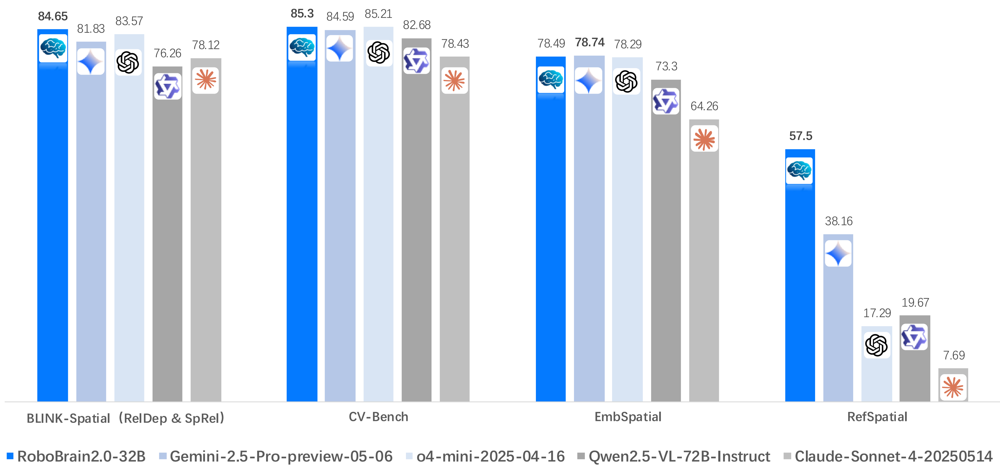
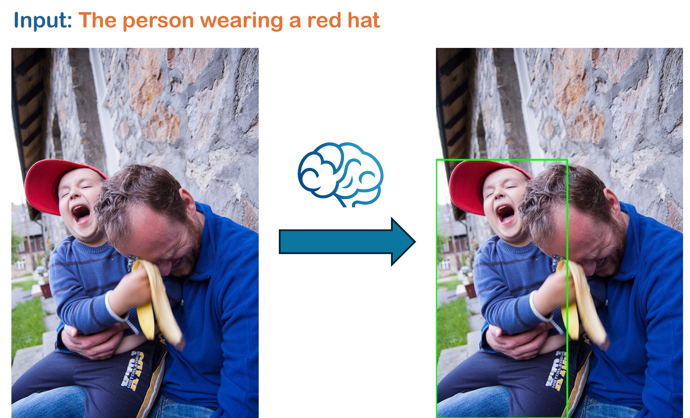
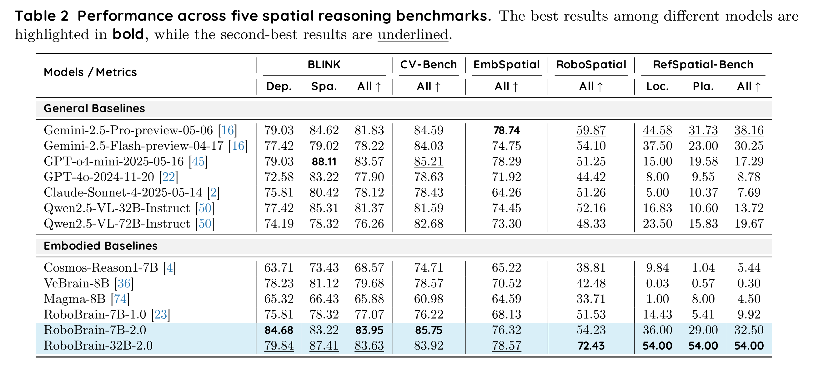
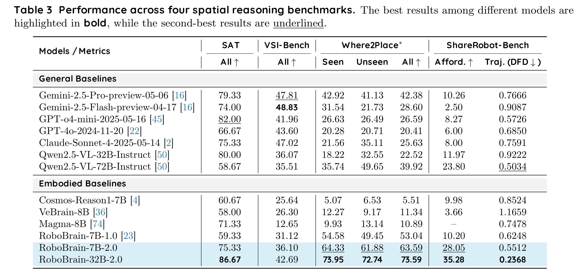
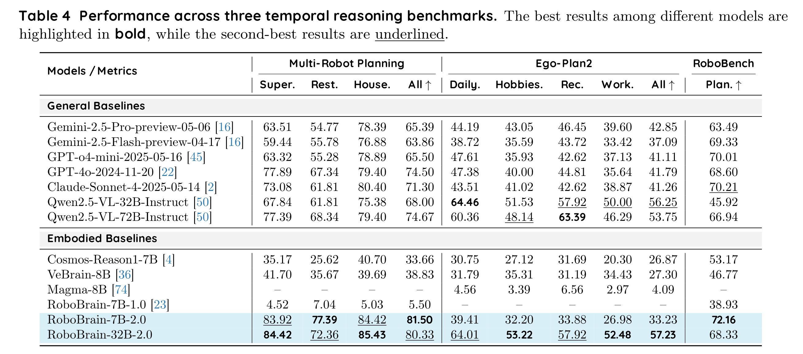

<div align="center">

</div>

# RoboBrain 2.0: See Better. Think Harder. Do Smarter. 


<p align="center">
        </a>&nbsp&nbsp⭐️ <a href="https://superrobobrain.github.io/">Project</a></a>&nbsp&nbsp | &nbsp&nbsp🤗 <a href="https://huggingface.co/collections/BAAI/robobrain20-6841eeb1df55c207a4ea0036/">Hugging Face</a>&nbsp&nbsp | &nbsp&nbsp🤖 <a href="https://www.modelscope.cn/models/BAAI/RoboBrain2.0-7B/files/">ModelScope</a>&nbsp&nbsp 

</p>
<p align="center">
        </a>&nbsp&nbsp📖 <a href="https://wisemodel.cn/models/BAAI/RoboBrain2.0-7B">Wisemodel</a>&nbsp&nbsp | &nbsp&nbsp📑 <a href="https://arxiv.org/abs/2507.02029 ">Technical Report</a>&nbsp&nbsp | &nbsp&nbsp💬 <a href="./assets/wechat.png">WeChat & RedNote</a>
</p>

</p>
<p align="center">
        </a>&nbsp&nbsp🎯 <a href="https://flagopen.github.io/RoboOS/">RoboOS</a>: An Efficient Open-Source Multi-Robot Coordination System for RoboBrain.
</p>
<p align="center">
</a>&nbsp&nbsp🌍 <a href="https://github.com/FlagOpen/RoboBrain">RoboBrain 1.0</a>: A Unified Brain Model for Robotic Manipulation from Abstract to Concrete.
</p>

💬 ***If you have any questions, feel free to contact us via WeChat or RedNote.***
<div align="center">

</div>

## 🔥 Overview
We are excited to introduce **RoboBrain 2.0**, the most powerful open-source embodied brain model to date. Compared to its predecessor, RoboBrain 1.0, our latest version are designed to unify perception, reasoning, and planning for complex embodied tasks in physical environments. It comes in two variants: a lightweight 7B model and a full-scale 32B model, featuring a heterogeneous architecture with a vision encoder and a language model. Despite its compact size, RoboBrain 2.0 achieves strong performance 
across a wide spectrum of embodied reasoning tasks. On both spatial and temporal benchmarks, the 32B variant achieves leading results in most cases, surpassing prior open-source and proprietary models.
In particular, it supports key real-world embodied intelligence capabilities, including spatial understanding (e.g., affordance prediction, spatial referring, trajectory forecasting) and temporal decision-making (e.g., closed-loop interaction, multi-agent long-horizon planning, and real-time scene memory). This report details the model architecture, data construction, multi-stage training strategies, infrastructure and practical applications. We hope RoboBrain 2.0 advances embodied AI research and serves as a practical step toward building generalist embodied agents.

<div align="center">

</div>

## 🗞️ News
- **`2025-07-23`**: 🤗 [RoboBrain 2.0-3B](https://huggingface.co/BAAI/RoboBrain2.0-3B) model checkpoint has been also released in Huggingface.
- **`2025-07-03`**: 🤗 [RoboBrain 2.0-32B](https://huggingface.co/BAAI/RoboBrain2.0-32B) model checkpoint has been released in Huggingface.
- **`2025-06-11`**: 💡 We optimized the inference pipeline for **multi-task applications** in RoboBrain 2.0. Please refer to [Simple Inference](https://github.com/FlagOpen/RoboBrain2.0/tree/main?tab=readme-ov-file#-simple-inference) for quick usage (general & embodied).
- **`2025-06-07`**: 🎉 We highlight the training framework ([FlagScale](https://github.com/FlagOpen/FlagScale)) developed by *BAAI Framework R&D team*, and the evaluation framework ([FlagEvalMM](https://github.com/flageval-baai/FlagEvalMM)) by *BAAI FlagEval team*. Both are used for RoboBrain 2.0. 
- **`2025-06-06`**: 🤗 [RoboBrain 2.0-7B](https://huggingface.co/BAAI/RoboBrain2.0-7B) model checkpoint has been released in Huggingface.
- **`2025-06-06`**: 🔥 We're excited to announce the release of our more powerful [RoboBrain 2.0](https://superrobobrain.github.io/).
- **`2025-04-11`**: 🎉 [RoboBrain 1.0](https://github.com/FlagOpen/RoboBrain/) was selected for CVPR 2025's official [Embodied AI Trends Commentary](https://cvpr.thecvf.com/Conferences/2025/News/AI_Enhanced_Robotics).
- **`2025-02-27`**: 🌍 [RoboBrain 1.0](http://arxiv.org/abs/2502.21257/) was accepted to CVPR2025.


## 📆 Todo
- [x] Release model checkpoint for RoboBrain 2.0-3B
- [x] Release model checkpoint for RoboBrain 2.0-7B
- [x] Release model checkpoint for RoboBrain 2.0-32B
- [x] Release quick inference example for RoboBrain 2.0
- [x] Release training and evaluation codes for RoboBrain 2.0

## 🚀 Features
**RoboBrain 2.0** supports ***interactive reasoning*** with long-horizon planning and closed-loop feedback, ***spatial perception*** for precise point and bbox prediction from complex instructions, ***temporal perception*** for future trajectory estimation, and ***scene reasoning*** through real-time structured memory construction and update.

<div align="center">

</div>


## ⭐️ Architecture
**RoboBrain 2.0** supports ***multi-image***, ***long video***, and ***high-resolution visual inputs***, along with complex task instructions and structured ***scene graphs*** on the language side. Visual inputs are processed via a Vision Encoder and MLP Projector, while textual inputs are tokenized into a unified token stream. All inputs are fed into a ***LLM Decoder*** that performs ***long-chain-of-thought reasoning*** and outputs structured plans, spatial relations, and both ***relative*** and ***absolute coordinates***.

<div align="center">

</div>


## 🤗 Model Zoo


| Models               | Checkpoint                                                     | Description                                                | 
|----------------------|----------------------------------------------------------------|------------------------------------------------------------|
| RoboBrain 2.0 3B     | [🤗 BAAI/RoboBrain2.0-3B](https://huggingface.co/BAAI/RoboBrain2.0-3B)   | 3B parameter version of the RoboBrain2.0                 | 
| RoboBrain 2.0 7B     | [🤗 BAAI/RoboBrain2.0-7B](https://huggingface.co/BAAI/RoboBrain2.0-7B)   | 7B parameter version of the RoboBrain2.0                 | 
| RoboBrain 2.0 32B    | [🤗 BAAI/RoboBrain2.0-32B](https://huggingface.co/BAAI/RoboBrain2.0-32B) | 32B parameter version of the RoboBrain2.0                |


## 🛠️ Setup

```bash
# clone repo.
git clone https://github.com/FlagOpen/RoboBrain2.0.git
cd RoboBrain

# build conda env.
conda create -n robobrain2 python=3.10
conda activate robobrain2
pip install -r requirements.txt
```


## 💡 Simple Inference

### 1. Predict without thinking (General)
```python
from inference import SimpleInference

model = SimpleInference("BAAI/RoboBrain2.0-7B")

prompt = "What is shown in this image?"
image = "http://images.cocodataset.org/val2017/000000039769.jpg"

pred = model.inference(prompt, image, task="general", enable_thinking=False, do_sample=True)
print(f"Prediction:\n{pred}")

"""
Prediction: (as an example)
{
        'thinking': '', 
        'answer': 'Two cats sleeping side by side on a couch.'
}
"""
```

### 2. Predict with thinking (General)
```python
from inference import SimpleInference

model = SimpleInference("BAAI/RoboBrain2.0-7B")

prompt = "What is shown in this image?"
image = "http://images.cocodataset.org/val2017/000000039769.jpg"

pred = model.inference(prompt, image, task="general", enable_thinking=True, do_sample=True)
print(f"Prediction:\n{pred}")

"""
Prediction: (as an example)
{
        'thinking': 'Upon examining the visual input, I observe two cats resting comfortably on a pink blanket that covers a couch or sofa. The cats are lying side by side, with one on top of the other, indicating their relaxed state and possibly their close bond. Their positions suggest they feel safe and at ease in their environment.\n\nWith my advanced visual processing capabilities, I can identify various objects within this scene, such as the pink blanket beneath the cats and the couch they are lying on. Additionally, there appear to be remote controls nearby, potentially situated on or near the couch, which further confirms that this is an indoor setting where people relax and spend leisure time.', 
        'answer': 'The image shows two cats lying on a pink blanket on a couch.'
}
"""
```

### 3. Usage for Visual Grounding (VG)
```python
from inference import SimpleInference

model = SimpleInference("BAAI/RoboBrain2.0-7B")

prompt = "the person wearing a red hat"
image = "./assets/demo/grounding.jpg"

pred = model.inference(prompt, image, task="grounding", plot=True, enable_thinking=True, do_sample=True)
print(f"Prediction:\n{pred}")

"""
Prediction: (as an example)
{
    'thinking': "From the visual input, I can identify two individuals: a man and a young boy. The man appears to be seated outside against a stone wall, wearing a blue top and jeans. His hands are around the young boy's waist. The boy is wearing a red baseball cap and a striped sweater, and he seems to be laughing or having fun while interacting with the man.\n\nNow focusing on the task at hand, which involves identifying the person wearing a red hat. In this scenario, it would be reasonable to deduce that the boy, who is wearing a red baseball cap, is the one wearing the red hat. The red cap stands out against the other elements in the scene due to its bright color, making it easy to pinpoint as the object in question.\n\nTherefore, based on direct visual analysis, the person wearing the red hat is indeed the young boy, and his position relative to the man is such that he is seated close to him along the stone wall.", 
    'answer': '[0, 193, 226, 640]'
}
"""
```

<div align="center">

</div>


### 4. Usage for Affordance Prediction (Embodied)
```python
from inference import SimpleInference

model = SimpleInference("BAAI/RoboBrain2.0-7B")

# Example:
prompt = "hold the cup"

image = "./assets/demo/affordance.jpg"

pred = model.inference(prompt, image, task="affordance", plot=True, enable_thinking=True, do_sample=True)
print(f"Prediction:\n{pred}")

"""
Prediction: (as an example)
{
    'thinking': "From the visual input, the object is recognized as a white ceramic cup with a handle on its side. It appears cylindrical with an open top and has sufficient height for a standard drinking cup. The handle is positioned to one side, which is crucial for grasping. The cup rests on a wooden surface, suggesting stability due to its weight and material solidity.\n\nMy end-effector is equipped with a gripper capable of securely engaging objects of this size and shape, specifically designed for cylindrical and handle-like surfaces. Given my capabilities, I can adjust the grip to accommodate the handle's size and curve. The gripper can easily access the handle area without disturbing the cup's balance on the flat surface.\n\nThe current task is to hold the cup, which necessitates securely gripping it by the handle or potentially enveloping the body if necessary. The cup’s position on the table, within reach, allows me to approach from the left side toward the handle, ensuring optimal leverage for lifting. \n\nVerifying the handle's suitability, it seems sufficiently robust and unobstructed to enable a reliable grip. My sensors will ensure that the force applied through the gripper doesn't exceed the cup's weight and stability limits.\n\nTherefore, the cup's affordance area is [577, 224, 638, 310]. This is because the handle provides a clear and accessible spot for my gripper to engage securely, fulfilling the task requirement to hold the cup effectively.", 
    'answer': '[577, 224, 638, 310]'
}
"""
```

<div align="center">

</div>


### 5. Usage for Trajectory Prediction (Embodied)
```python
from inference import SimpleInference

model = SimpleInference("BAAI/RoboBrain2.0-7B")

# Example:
prompt = "reach for the banana on the plate"

image = "./assets/demo/trajectory.jpg"

pred = model.inference(prompt, image, task="trajectory", plot=True, enable_thinking=True, do_sample=True)
print(f"Prediction:\n{pred}")

"""
Prediction: (as an example)
{
    'thinking': 'From the visual input, the target object, a banana, is placed upon a circular plate towards the center-right of the table. My end-effector is positioned near the left edge of the table, ready to initiate movement. A spatial analysis of the scene reveals potential obstructions such as various dishes and objects around the plate. The plate itself defines the immediate vicinity of the target.\n\nMy joint control system enables me to generate smooth trajectories for my end-effector. I will plan a sequence starting from my current position, moving across the table until it reaches the banana, while ensuring clearance from obstacles. The trajectory must be efficient in reaching the target without unnecessary detours or collisions.\n\nThe task is to "reach for the banana on the plate", necessitating a path that begins at my current location and terminates at or very near the banana. Up to 10 key points can be utilized, but fewer may suffice if the path is straightforward.\n\nI verify the proposed path by mentally simulating the trajectory. Considering the table layout, the path needs to navigate away from the nearest glass and avoid the bottle on the right-hand side. Each segment of the trajectory should present sufficient clearance from these objects. The final point must precisely align with the banana\'s location on the plate.\n\nTherefore, based on direct vision analysis, motion planning capabilities, and task requirements, the trajectory points to reach the banana are determined as follows: [(137, 116), (169, 94), (208, 84), (228, 80)]. This sequence forms a viable path from the current end-effector position to the target, respecting the visual environment.', 
    'answer': '[(137, 116), (169, 94), (208, 84), (228, 80)]'
}
"""
```

<div align="center">

</div>

### 6. Usage for Pointing Prediction (Embodied)
```python
from inference import SimpleInference

model = SimpleInference("BAAI/RoboBrain2.0-7B")

# Example:
prompt = "Identify several spots within the vacant space that's between the two mugs"

image = "./assets/demo/pointing.jpg"

pred = model.inference(prompt, image, task="pointing", plot=True, enable_thinking=True, do_sample=True)
print(f"Prediction:\n{pred}")

"""
Prediction: (as an example)
{
    'thinking': 'From the visual input, there is a clear division between two mugs with distinct colors: one blue and one green. The blue mug is positioned towards the left side, while the green mug is on the right side of the scene. The task requires identifying spots between these two mugs.\n\nMy visual processing allows me to focus on the area between the blue mug and the green mug. This region appears to be moderately uniform in texture relative to the surrounding surfaces. I see no significant objects or textures interfering directly between them, suggesting an open space suitable for placing points.\n\nTo fulfill the requirement of identifying multiple spots within this vacant region, I will select distinct pixel coordinates that lie between the mugs, ensuring they are not centered on the mugs themselves or any visible obstructions. My approach involves choosing several points distributed across this gap, maintaining a reasonable spread to reflect "several" distinct locations.\n\nVerification ensures each selected point lies strictly within the visible vacant space between the two cups, away from the edges or any mugs\' contours. Distinctness among points is confirmed to ensure no overlap occurs.\n\nThus, based on direct visual analysis and task requirements, identified points within the vacant area between the two mugs include (376, 309), (332, 357), (384, 335), (343, 296), (348, 327), (328, 346), (371, 322), (392, 303), (380, 324), and (337, 295). These points satisfy all conditions specified by the task.',
    'answer': '[(376, 309), (332, 357), (384, 335), (343, 296), (348, 327), (328, 346), (371, 322), (392, 303), (380, 324), (337, 295)]'
}
"""
```

<div align="center">

</div>


### 7. Usage for Navigation Tasks (Embodied)
```python
from inference import SimpleInference

model = SimpleInference("BAAI/RoboBrain2.0-7B")

# Example 1:
prompt_1 = "Identify several spots within toilet in the house"

image = "./assets/demo/navigation.jpg"

pred = model.inference(prompt_1, image, task="pointing", plot=True, enable_thinking=True, do_sample=True)
print(f"Prediction:\n{pred}")

# Example 2:
prompt_2 = "Identify several spots within the sofa that can be used for sitting"

image = "./assets/demo/navigation.jpg"

pred = model.inference(prompt_2, image, task="pointing", plot=True, enable_thinking=True, do_sample=True)
print(f"Prediction:\n{pred}")

"""
Prediction: (as an example 1: toilet)
{
    'thinking': 'From the visual input, I discern the presence of a toilet located centrally on the tiled floor within the frame. Its rectangular form is evident against the darker-toned tiles adjacent to lighter-colored ones, providing visual contrast. I focus on identifying points that accurately represent distinct locations on the toilet\'s surface to satisfy the task requirement.\n\nMy advanced visual processing allows me to segment this toilet from its surrounding elements effectively. Points must be selected such that they do not overlap with other objects or textures interfering with recognizing the toilet specifically. The smooth surface and consistent texture of the toilet allow for precise point identification across its visible areas.\n\nThe task explicitly requires identifying several spots within the toilet. I proceed by carefully selecting multiple distinct coordinates distributed across the toilet’s surface, ensuring they reflect varied positions. These spots are verified to lie strictly within the boundaries of the toilet itself while maintaining their distinctness and avoiding redundancy.\n\nFollowing my visual analysis, I determine the points (318, 445), (293, 466), (307, 478), (277, 459), (320, 456), and (304, 450) as valid choices. These coordinates are well-distributed over the toilet’s surface, ensuring adherence to the task requirements to locate "several" spots.', 
    'answer': '[(318, 445), (293, 466), (307, 478), (277, 459), (320, 456), (304, 450)]'
}

Prediction: (as an example 2: sofa)
{
    'thinking': "From the visual input, my attention is drawn to a sofa situated against a wooden wall with a distinct texture apparent through its surface pattern. The sofa is composed of cushions and has an apparent soft, inviting structure suitable for sitting. The task requires identifying specific spots on this sofa that can be used comfortably.\n\nThe sofa lies horizontally across the bottom section of the image, extending along the floor's edge. The cushions appear to be evenly spaced, providing consistent seating options. The primary focus area involves pinpointing these regions for potential sitting spots—ensuring they lie within the visible seating area without touching the edges or overlapping any other objects or features.\n\nAs I systematically examine this region, I focus on the cushioned parts of the sofa where there are no structural interruptions or obstructions. These smooth areas provide optimal surfaces for sitting. By assessing the sofa visually, I can select points that are spaced adequately apart, ensuring comfort and utility.\n\nUpon verification, I confirm that these chosen coordinates represent well-distributed points over the entire seating area of the sofa, avoiding any overlaps or intrusions into non-cushioned sections. Each point thus falls distinctly within the intended zone for sitting.\n\nConsequently, based on this direct visual analysis, I identify the following points: (369, 1197), (385, 1190), (359, 1176), and (387, 1172). These coordinates are within the defined couch area, ensuring they comply with the task requirements effectively.", 
    'answer': '[(369, 1197), (385, 1190), (359, 1176), (387, 1172)]'
}
"""
```

<div align="center">

</div>

<div align="center">

</div>

## 🤖 Training

### Option 1: For Megatron User (Highly Recommended)

<div align="center">

</div>

We adopted the distributed training framework [FlagScale](https://github.com/FlagOpen/FlagScale) developed by the ***Framework R&D team of BAAI*** for training. The training can be launched in the following steps:

You can refer to the [QuickStart.md](https://github.com/FlagOpen/FlagScale/blob/dc6e8248eafe6f03e66e2735400378e5db1f67dd/flagscale/train/models/qwen2_5_vl/QuickStart.md) to train the base instruct model or finetune the RoboBrain2.0.

### Option 2: For DeepSpeed User

RoboBrain2.0 is also compatible with the official training code for Qwen2.5VL. Please refer to [qwen-vl-finetune](https://github.com/QwenLM/Qwen2.5-VL/tree/main/qwen-vl-finetune).


## 🔍 Evaluation

<div align="center">

</div>

We adopted the flexible evaluation framework [FlagEvalMM](https://github.com/flageval-baai/FlagEvalMM) developed by the ***FlagEval team of BAAI*** for comprehensive multimodal model evaluation. The evaluation can be launched in the following steps:

**Step 1:**
Refer to the instructions at [FlagEvalMM](https://github.com/flageval-baai/FlagEvalMM) for installation, configuration, and data preparation.

**Step 2:**
Execute the evaluation command (as an example):
```bash
flagevalmm --tasks tasks/where2place/where2place.py \
        --exec model_zoo/vlm/api_model/model_adapter.py \
        --model BAAI/RoboBrain2.0-7B \
        --num-workers 8 \
        --output-dir ./results/RoboBrain2.0-7B \
        --backend vllm \
        --extra-args "--limit-mm-per-prompt image=18 --tensor-parallel-size 4 --max-model-len 32768 --trust-remote-code --mm-processor-kwargs '{\"max_dynamic_patch\":4}'"
```

## 😊 More Results

**Benchmark comparison across spatial reasoning and temporal task planning.** ***RoboBrain2.0*** achieves state-of-the-art (SOTA) or near-SOTA performance on nine spatial reasoning benchmarks: ***BLINK-Spatial***, ***CV-Bench***, ***EmbSpatial***, ***RoboSpatial***, ***RefSpatial***, ***SAT***, ***VSI-Bench***, ***Where2Place*** and ***ShareRobot-Bench***, and three temporal reasoning benchmarks: ***Multi-Robot-Planning***, ***Ego-Plan2*** and ***RoboBench-Planning***,  It not only outperforms leading open-source models such as Cosmos-Reason1 and Qwen2.5-VL, but also surpasses closed-source models like Gemini 2.5 Pro, o4-mini and Claude Sonnet 4.

<div align="center">

</div>

<div align="center">

</div>

<div align="center">

</div>


## 📑 Citation
If you find this project useful, welcome to cite us.
```bib
@article{RoboBrain2.0TechnicalReport,
    title={RoboBrain 2.0 Technical Report},
    author={BAAI RoboBrain Team},
    journal={arXiv preprint arXiv:2507.02029},
    year={2025}
}

@article{RoboBrain1.0,
    title={Robobrain: A unified brain model for robotic manipulation from abstract to concrete},
    author={Ji, Yuheng and Tan, Huajie and Shi, Jiayu and Hao, Xiaoshuai and Zhang, Yuan and Zhang, Hengyuan and Wang, Pengwei and Zhao, Mengdi and Mu, Yao and An, Pengju and others},
    journal={arXiv preprint arXiv:2502.21257},
    year={2025}
}

@article{RoboOS,
    title={RoboOS: A Hierarchical Embodied Framework for Cross-Embodiment and Multi-Agent Collaboration},
    author={Tan, Huajie and Hao, Xiaoshuai and Chi, Cheng and Lin, Minglan and Lyu, Yaoxu and Cao, Mingyu and Liang, Dong and Chen, Zhuo and Lyu, Mengsi and Peng, Cheng and He, Chenrui and Ao, Yulong and Lin, Yonghua and Wang, Pengwei and Wang, Zhongyuan and Zhang, Shanghang},
    journal={arXiv preprint arXiv:2505.03673},
    year={2025}
}

@article{zhou2025roborefer,
    title={RoboRefer: Towards Spatial Referring with Reasoning in Vision-Language Models for Robotics},
    author={Zhou, Enshen and An, Jingkun and Chi, Cheng and Han, Yi and Rong, Shanyu and Zhang, Chi and Wang, Pengwei and Wang, Zhongyuan and Huang, Tiejun and Sheng, Lu and others},
    journal={arXiv preprint arXiv:2506.04308},
    year={2025}
}

@article{Reason-RFT,
    title={Reason-rft: Reinforcement fine-tuning for visual reasoning},
    author={Tan, Huajie and Ji, Yuheng and Hao, Xiaoshuai and Lin, Minglan and Wang, Pengwei and Wang, Zhongyuan and Zhang, Shanghang},
    journal={arXiv preprint arXiv:2503.20752},
    year={2025}
}

@article{Code-as-Monitor,
    title={Code-as-Monitor: Constraint-aware Visual Programming for Reactive and Proactive Robotic Failure Detection},
    author={Zhou, Enshen and Su, Qi and Chi, Cheng and Zhang, Zhizheng and Wang, Zhongyuan and Huang, Tiejun and Sheng, Lu and Wang, He},
    journal={arXiv preprint arXiv:2412.04455},
    year={2024}
}
```
